# End-to-End AWS DevOps Monitoring Project

## Project Overview

In this project, I built a complete DevOps and cloud monitoring environment on AWS using a multi-server architecture. The solution includes secure VPN-based access, authentication, file upload automation, CI/CD routing, cloud storage integration, infrastructure monitoring, alerting, and queue monitoring.

This project simulates a real-world production-style DevOps workflow.

---

## Architecture Summary

The project consists of **3 EC2 servers**:

- **Server 1** – Firewall + OpenVPN + Login/Signup Website + MySQL
- **Server 2** – Upload application server
- **Server 3** – Jenkins + Prometheus + Grafana + CloudWatch integration

### File Routing Logic

- **Documents / images** (`pdf`, `docx`, `xlsx`, `png`, `jpg`) are routed to **Amazon S3**
- **Code files** (`py`, `yaml`, `json`, `sql`) are routed to **GitHub**

### Monitoring and Alerting

- **Prometheus** for metrics collection
- **Node Exporter** for CPU, RAM, and disk metrics
- **Grafana** for dashboards
- **CloudWatch** for AWS alarms
- **SNS** for email notifications
- **SQS** for queue monitoring

---

## AWS Services Used

- Amazon EC2
- Amazon VPC
- Security Groups
- Amazon S3
- Amazon CloudWatch
- Amazon SNS
- Amazon SQS
- IAM

---

## DevOps and Monitoring Tools Used

- Jenkins
- GitHub
- Prometheus
- Node Exporter
- Grafana
- Apache
- PHP
- MySQL
- OpenVPN

---

## Screenshots

### 1. EC2 Instances Overview
This screenshot shows the three EC2 instances used in the project: firewall/VPN server, application upload server, and Jenkins/monitoring server.

![[EC2 Instances]](01-ec2-servers.png)

---

### 2. VPN Required To Access Application
When VPN is disconnected, the internal application is not accessible. This ensures the system is protected behind a secure network.

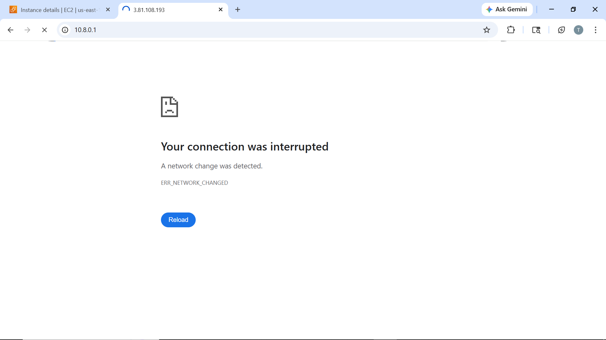

---

### 3. VPN Connected Successfully
After connecting using OpenVPN, the internal private application becomes accessible.

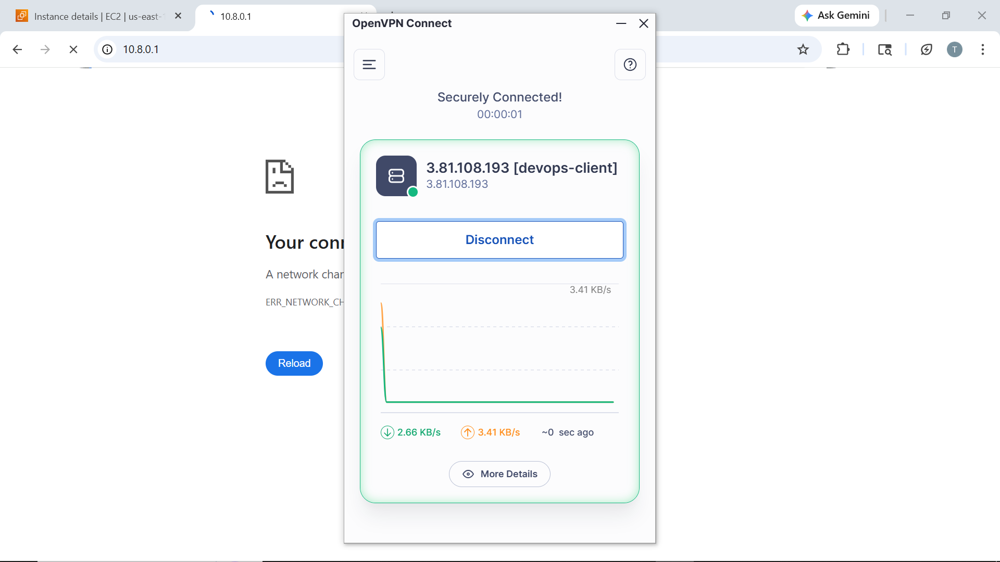

---

### 4. DevOps Project Homepage
This is the main landing page where users can choose signup or login.

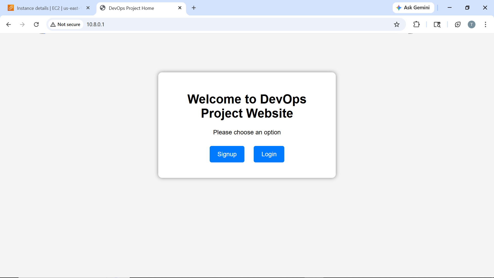

---

### 5. Login Page
Users authenticate using credentials stored in MySQL database.

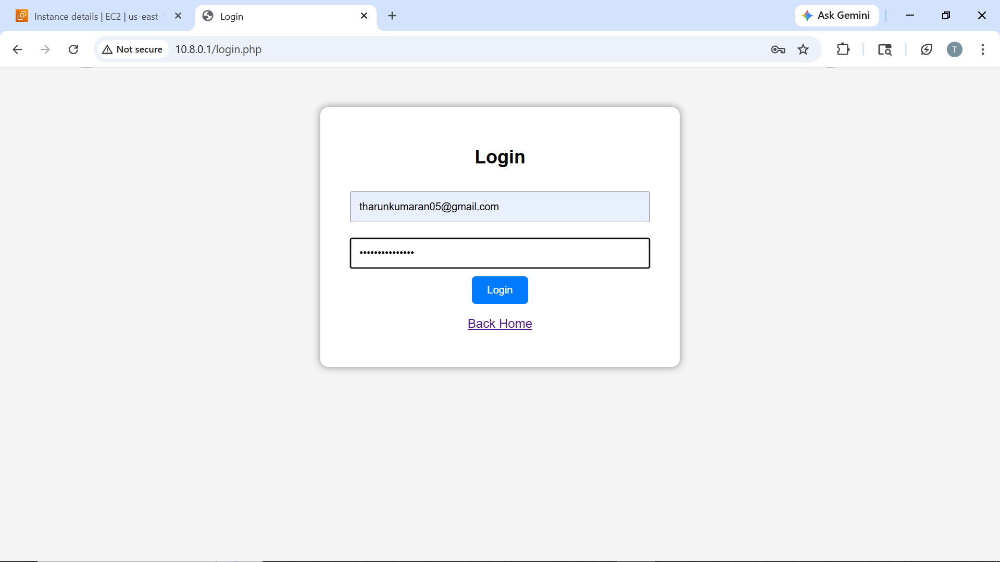

---

### 6. Signup Page
New users register using username, email and password.

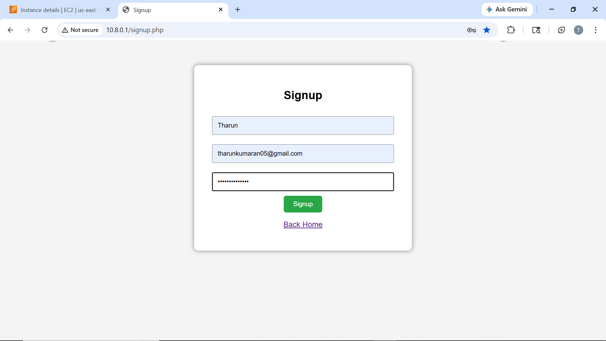

---

### 7. Signup Success
Successful user registration confirmation.

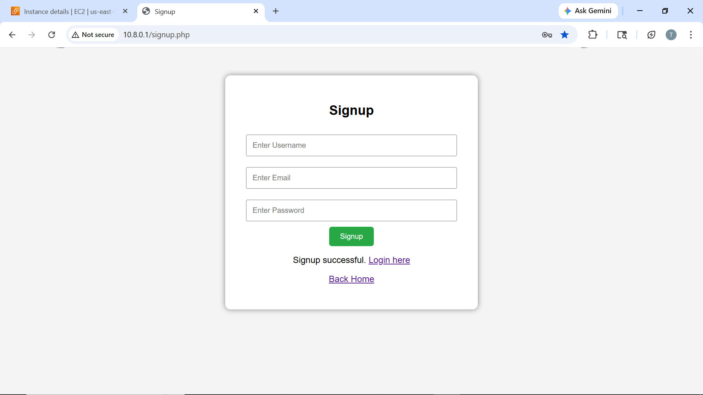

---

### 8. Upload Page
This page allows users to upload files that will be routed by Jenkins.

---

### 9. File Selected for Upload
This screenshot shows a file selected in the upload form before pressing the upload button.

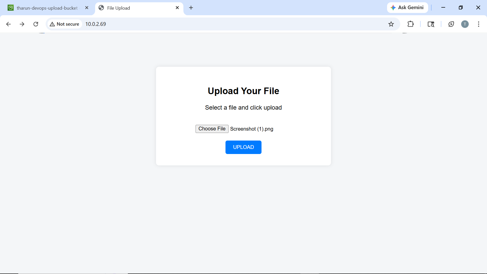

---

### 10. Upload Success
This screenshot confirms successful file upload through the application.

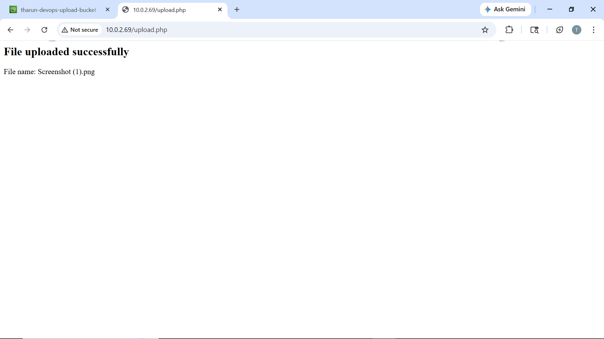

---

### 11. Amazon S3 Bucket Objects
This screenshot shows uploaded files stored in the S3 bucket.

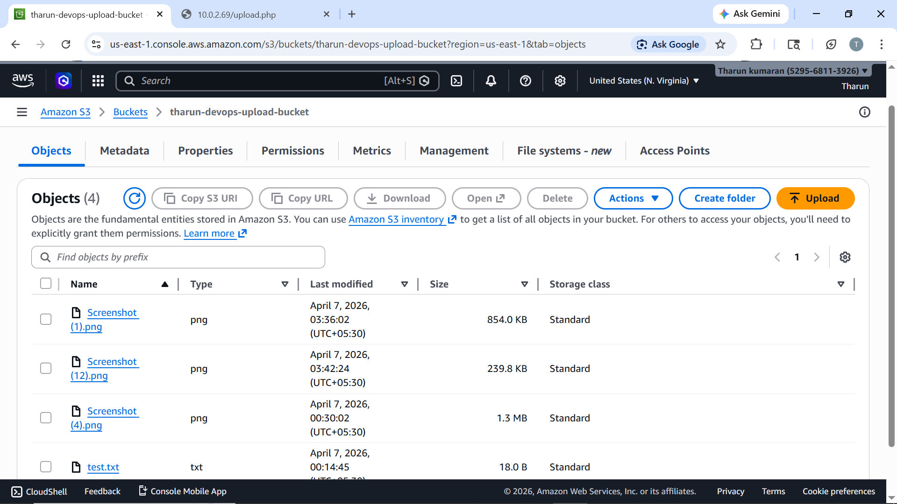

---

### 12. GitHub Repository Upload
This screenshot shows code files pushed to the GitHub repository by the Jenkins pipeline.

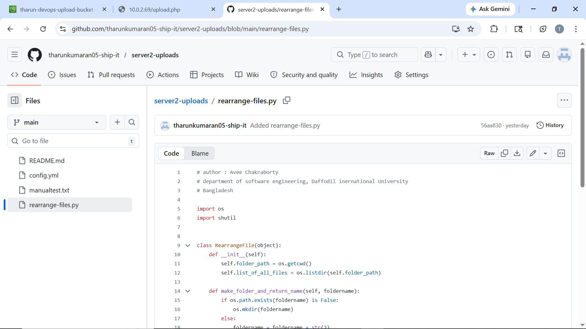

---

### 13. Jenkins Pipeline
This screenshot shows the Jenkins pipeline job used to route uploaded files.

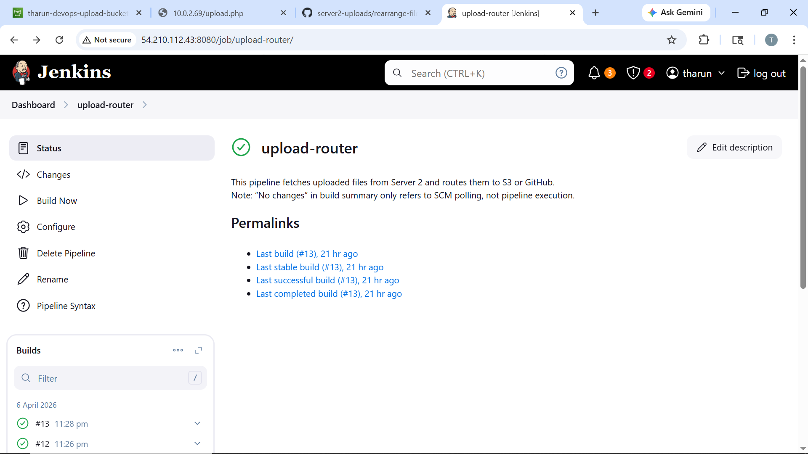

---

### 14. Prometheus Targets
This screenshot confirms Prometheus is successfully scraping its targets.

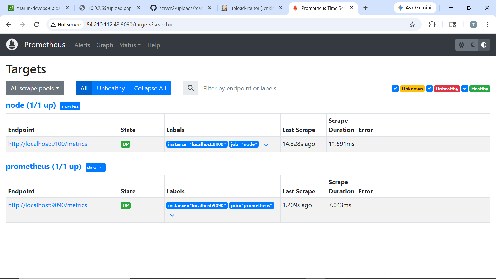

---

### 15. Grafana Dashboard
This screenshot shows the Grafana dashboard for CPU, RAM, disk, and load monitoring.

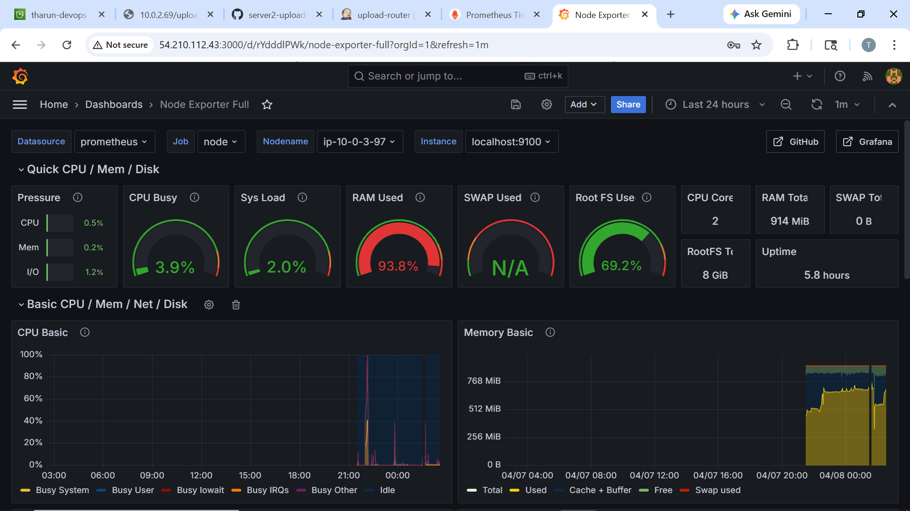

---

### 16. CloudWatch Alarms
This screenshot shows the CloudWatch alarms used for CPU utilization, Jenkins health, and SQS queue backlog.

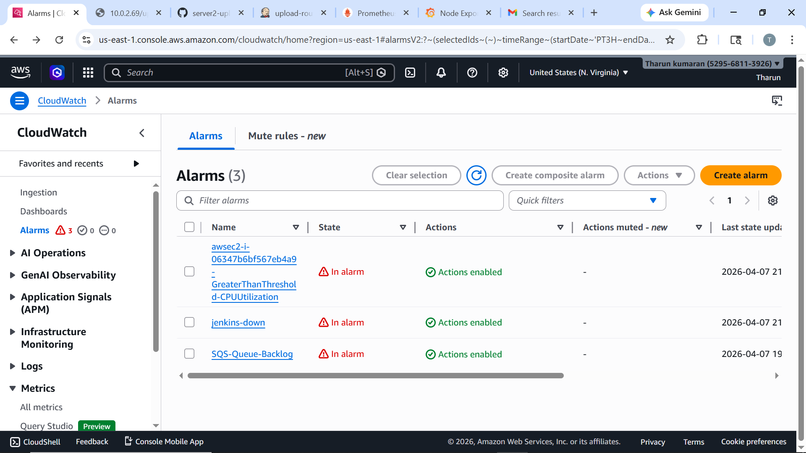

---

### 17. CPU Alert Email
This screenshot shows the SNS email notification triggered by the CPU utilization alarm.

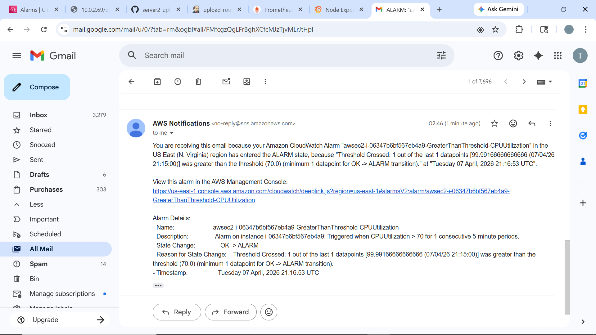

---

### 18. Jenkins Alert Email
This screenshot shows the SNS email notification triggered when Jenkins service went down.

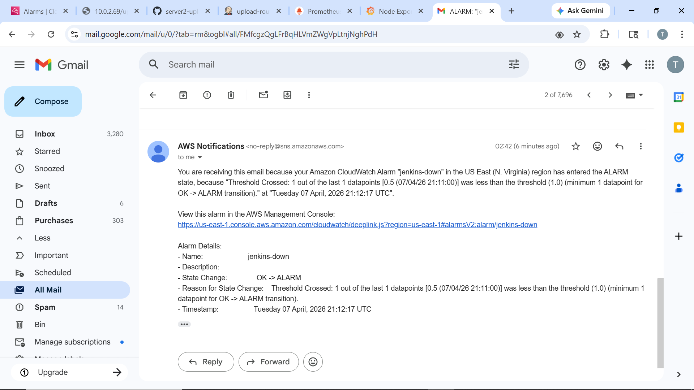

---

### 19. SQS Alert Email
This screenshot shows the SNS email notification triggered by SQS queue backlog.

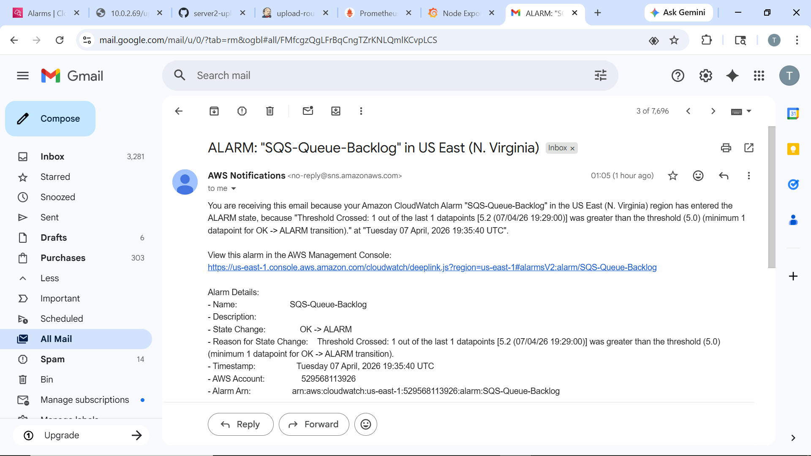

---

### 20. SQS Queue Metric Graph
This screenshot shows the CloudWatch metric graph for `ApproximateNumberOfMessagesVisible`.

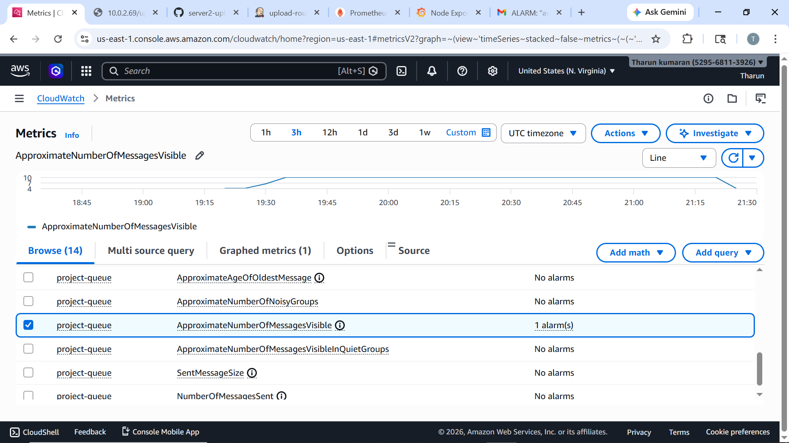

---

## End-to-End Workflow

1. User connects through OpenVPN  
2. User signs up or logs in on Server 1  
3. User uploads file from Server 2  
4. Jenkins on Server 3 processes the file  
5. Documents/images are stored in S3  
6. Code files are pushed to GitHub  
7. Prometheus collects metrics  
8. Grafana visualizes system health  
9. CloudWatch monitors alarms  
10. SNS sends email notifications  
11. SQS queue metrics are tracked for backlog monitoring  

---

## What I Learned

Through this project, I learned:

- How to design a multi-tier AWS architecture
- How to secure application access using VPN
- How to automate file routing using Jenkins
- How to integrate S3 and GitHub into a DevOps workflow
- How to monitor infrastructure using Prometheus and Grafana
- How to use CloudWatch, SNS, and SQS for alerting and monitoring

---

## Conclusion

This project demonstrates a complete DevOps and cloud monitoring pipeline using AWS and open-source tools. It combines security, automation, storage, monitoring, and alerting into a single production-style architecture.
